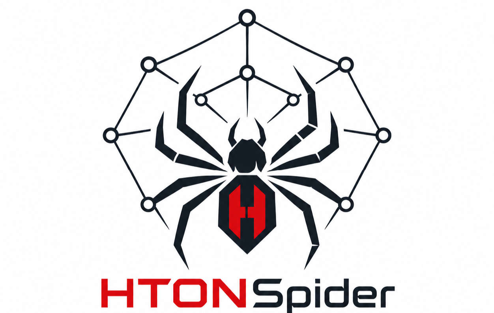

<div align="center">
    
</div>

A networking toolkit for analize, trace, and filter active proxies

---

### Installation and Usage

```bash
git clone https://github.com/MatrixTM26/HTONSpider.git
cd HTONSpider
```

### Compile

```bash
gcc -O2 -Wall -o htonspider htonspider.c -lpthread -lm
```

### Usage Example

**Tool Help**

```bash
./htonspider -h
```

```bash
./htonspider <module> [option]
```

```bash
./htonspider sub -h
```

**Proxy Check**

```bash
./htonspider -L Proxies.txt -P auto -E -F alive -T 1000 -v -t 5
```

```bash
./htonspider -s google.com -P <socket type: AUTO | HTTP | SOCKS4 | SOCKS5> -E <export filename> -F <filter type: alive | dead> -T <thread count> -v <verbose> -t <timeout>
```

**DNS Record Check**

```bash
./htonspider dns google.com -s 1.1.1.1
```

**Ping**

```bash
./htonspider ping google.com
```

**Trace**

```bash
./htonspider trace google.com
```

**Whois**

```bash
./htonspider whois google.com
```

**Subnet**

```bash
./htonspider subnet 172.0.0.0/24
```

**Subdomain Finder**

```bash
./htonspider sub -t example.com
```

```bash
./htonspider sub -t example.com -H -p 443 -F alive -T 1000
```

```bash
./htonspider sub -t example.com -H -p 443 -F alive -w wordlist/subdomain/default.txt -T 1000
```

**Directory Brute Forcing**

```bash
./htonspider dir -u example.com
```

```bash
./htonspider dir -u example.com -D 3 -T 1000 -t 5
```

```bash
./htonspider dir -u example.com -D 3 -T 1000 -t 5 -w wordlist/directories/default.txt
```

---

<div align="left">

## ◈ Support Me

If this project helps, you can support me here:

[](https://ko-fi.com/MatrixTM26)
[](https://trakteer.id/MatrixTM26)
[](https://paypal.me/TeukuMaulana)

</div>

---

<p align="center">&copy; 2023-2026 MatrixTM26</p>
