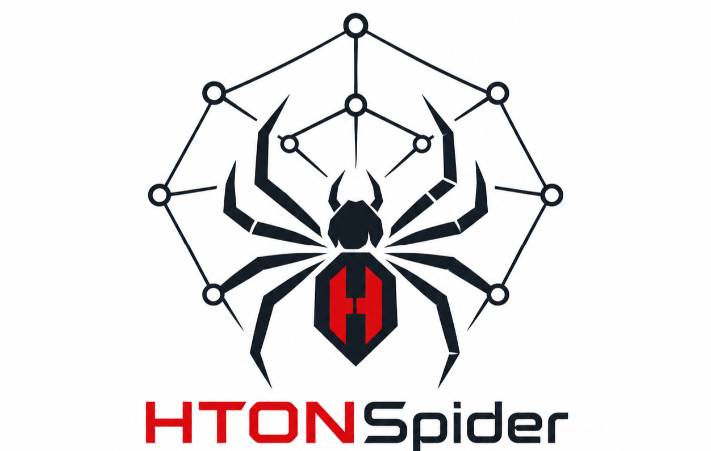

<div align="center">
    
</div>

A full network recon & security scanner — port scan, DNS trace, subdomain discovery, ARP sweep, proxy filter, path enumeration, and CVE detection in one tool

---

##  Installation & Usage

```bash
git clone https://github.com/MatrixTM26/HTONSpider.git
cd HTONSpider
```

### Compile

```bash
go build -o htonspider .
```

### Usage Example

**Tool Help**

```bash
./htonspider -h
```

**Port Scan**

```bash
./htonspider -m port -s example.com
```

```bash
./htonspider -m port -s example.com -p 1-1024 -b -T 300 -t 500 -e scan.txt
```

```bash
./htonspider -m port -s example.com -p all -U -T 500 -t 400
```

**DNS Resolve & Trace**

```bash
./htonspider -m dns -s example.com
```

```bash
./htonspider -m dns -s example.com -e dns.txt
```

**Subdomain Discovery**

```bash
./htonspider -m sub -s example.com
```

```bash
./htonspider -m sub -s example.com -W wordlist.txt -T 50 -e subdomains.txt
```

**ARP Network Scan**

```bash
./htonspider -m arp -s 192.168.1.0/24
```

```bash
./htonspider -m arp -s 192.168.1.0/24 -T 100 -e hosts.txt
```

**Proxy / IP Checker**

```bash
./htonspider -m proxy -s proxies.txt -A -e alive.txt
```

```bash
./htonspider -m proxy -s 103.10.1.1:8080,103.10.1.2:3128 -T 50 -t 5000
```

**Path & File Discovery**

```bash
./htonspider -m path -s https://example.com
```

```bash
./htonspider -m path -s https://example.com -W paths.txt -T 30 -e found.txt
```

**Service & Vulnerability Detection**

```bash
./htonspider -m vuln -s example.com
```

```bash
./htonspider -m vuln -s example.com -p 80,443,22,3306 -e report.txt
```

**Full Scan**

```bash
./htonspider -m full -s example.com
```

```bash
./htonspider -m full -s example.com -W wordlist.txt -p 1-1024 -T 200 -V -e full.txt
```

---

##  Command line argument

| Flag | Value    | Description                                                      |
| ---- | -------- | ---------------------------------------------------------------- |
| `-m` | `mode`   | Scan mode: `port` `dns` `sub` `arp` `proxy` `path` `vuln` `full` |
| `-s` | `target` | Host, IP, CIDR, comma-list, or file path                         |
| `-p` | `range`  | Port range: `80,443` \| `1-1024` \| `all` \| `common`            |
| `-t` | `ms`     | Timeout in milliseconds (default: `800`)                         |
| `-T` | `n`      | Concurrent threads (default: `200`)                              |
| `-W` | `file`   | Wordlist file for subdomain or path discovery                    |
| `-e` | `file`   | Export results to file                                           |
| `-A` |          | Alive-only export (proxy mode)                                   |
| `-U` |          | Also run UDP scan alongside TCP                                  |
| `-b` |          | Grab service banners                                             |
| `-V` |          | Verbose / debug output                                           |
| `-n` |          | Skip ASCII banner                                                |

---

##  Credit

- **Author:** [@MatrixTM26](https://github.com/MatrixTM26)
- **License:** [AGPL-V3](./LICENSE)

##  Support Me

[](https://ko-fi.com/MatrixTM26)
[](https://trakteer.id/MatrixTM26)
[](https://paypal.me/TeukuMaulana)

---

<p align="center">Copyright &copy;2023-2026 MatrixTM26 &middot; All Rights Reserved</p>
